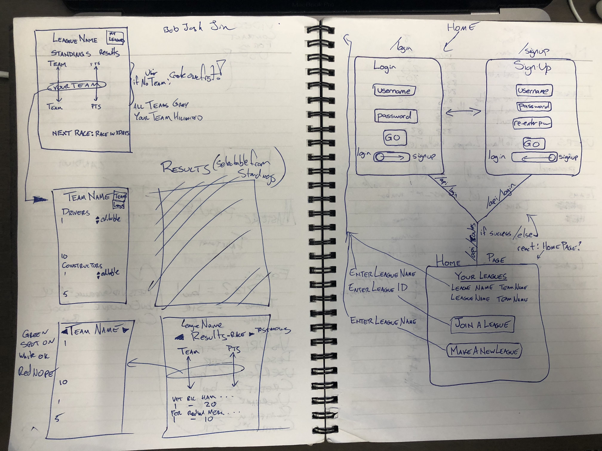

# Fantasy F1

### WireFrames & Basic Ideation:

  
    This project spawned from a group of friends and their mutual love of Formula 1.  After going to a few races, it was decided that we should compete on our knowledge of F1 drivers and constructors.  We looked for some Fantasy F1 leagues, but most of them run into the same problem we thought of: 2 drivers out of 20 are almost invariably going to win the race.  The other versions utilize a budget system to allow players to rotate the drivers throughout the season.  I decided to allow everyone to select every driver, and instead set a lineup of 10 drivers and 5 constructors.  The best at predicting results wins.

### Trello Board

  https://trello.com/b/IqVxgffW/fantasyf1

### Heroku Link

  https://f1fantasy.herokuapp.com

### Technologies Used

    #Back-End
    Node.js
    MySQL (ClearDB)
    Express
    Self-Built Authentication
    JSON Web Tokens
    
    #Front-End
    React
    HTML5/CSS3...

### Research

### Plans

The plan for this app is eventually deployment to the iOS and Android app stores. We believe that the app provides a unique usefulness for the c onsumer. Currently we are working on testing the app's abilities to use the native functions of the phone. 